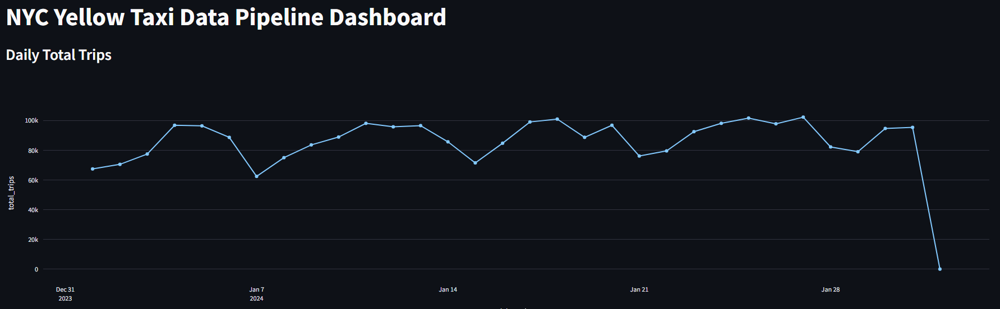
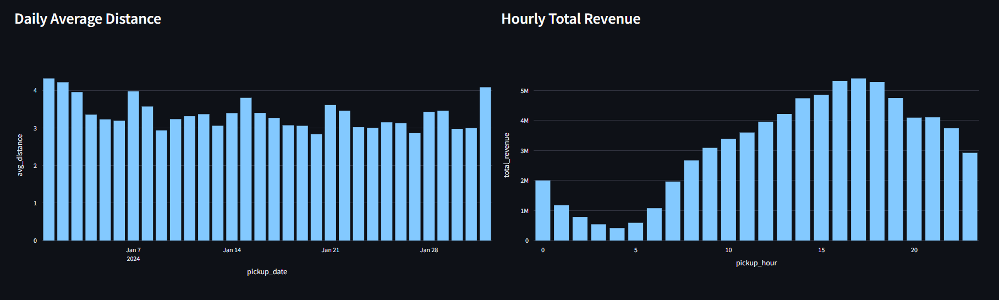

# Local Big Data Pipeline

An end-to-end, containerized big data engineering platform that ingests raw NYC Taxi trip data, processes it at scale with Apache Spark, orchestrates the workflow with Apache Airflow, persists results in PostgreSQL, visualizes them through a Streamlit dashboard, and validates every change through an automated CI/CD pipeline.

The project was built incrementally across nine phases, each implemented and merged as a separate pull request, so the full evolution of the architecture — including the bugs encountered and how they were resolved — is preserved in the repository's history.

## Table of Contents

- [Overview](#overview)
- [Architecture](#architecture)
- [Tech Stack](#tech-stack)
- [Project Structure](#project-structure)
- [Pipeline Phases](#pipeline-phases)
  - [Phase 1: Containerized Infrastructure and Network Isolation](#phase-1-containerized-infrastructure-and-network-isolation)
  - [Phase 2: Data Storage and JDBC Integration](#phase-2-data-storage-and-jdbc-integration)
  - [Phase 3: Distributed Data Processing Cluster](#phase-3-distributed-data-processing-cluster)
  - [Phase 4: ETL Development with PySpark](#phase-4-etl-development-with-pyspark)
  - [Phase 5: Data Visualization with Streamlit](#phase-5-data-visualization-with-streamlit)
  - [Phase 6: Workflow Orchestration with Apache Airflow](#phase-6-workflow-orchestration-with-apache-airflow)
  - [Phase 7: Resolving Container Dependency and Security Issues](#phase-7-resolving-container-dependency-and-security-issues)
  - [Phase 8: Data Quality and Anomaly Cleaning](#phase-8-data-quality-and-anomaly-cleaning)
  - [Phase 9: CI/CD and Automated Unit Testing](#phase-9-cicd-and-automated-unit-testing)
- [Engineering Challenges and Root Cause Analysis](#engineering-challenges-and-root-cause-analysis)
- [Getting Started](#getting-started)
- [Running Tests](#running-tests)
- [Future Improvements](#future-improvements)
- [License](#license)

## Overview

The core objective of this project is not to demonstrate a single tool in isolation, but to reproduce the way a production data platform is actually assembled: multiple independently deployed services (a distributed processing engine, an orchestration layer, a persistent data warehouse, a visualization layer, and a testing/deployment pipeline) that must be wired together reliably and reproducibly.

The dataset used is the NYC Taxi trip dataset in Parquet format. The pipeline extracts the raw data, computes business-relevant metrics (average trip distance, hourly revenue totals), removes invalid or anomalous records, loads the results into a relational data warehouse, and exposes them through an interactive dashboard — all fully automated on a daily schedule and covered by unit tests that run on every push.

## Architecture

The system is composed of five core services, all defined in a single `docker-compose.yml` and communicating over an isolated Docker network:

```
                         +-------------------+
                         |  GitHub Actions   |
                         |   (CI Pipeline)   |
                         +---------+---------+
                                   |
                                   v
    +----------------+     +--------------+     +------------------+
    |  Apache Airflow| --> | Apache Spark | --> |   PostgreSQL     |
    |  (Scheduler,   |     | (Master +    |     |  (Data Warehouse)|
    |   Webserver)   |     |  Worker)     |     |                  |
    +----------------+     +--------------+     +--------+---------+
                                                          |
                                                          v
                                                 +------------------+
                                                 |    Streamlit     |
                                                 |    Dashboard     |
                                                 +------------------+
```

- Airflow triggers a daily `spark-submit` job through a `BashOperator`.
- Spark reads raw Parquet files, applies transformation and cleaning logic, and writes the results to PostgreSQL through the JDBC driver.
- PostgreSQL acts as the analytical data warehouse consumed downstream.
- Streamlit queries PostgreSQL directly and renders interactive visualizations.
- GitHub Actions runs the Pytest suite against the transformation logic on every push to guarantee regressions are caught before merge.

All services share a common Docker network for isolation, and volume mounts are used both for data persistence and for exposing local source directories (`./data`, `./spark_jobs`) to the Airflow and Spark containers.

## Tech Stack

| Layer | Technology |
|---|---|
| Containerization | Docker, Docker Compose |
| Distributed Processing | Apache Spark (PySpark) |
| Orchestration | Apache Airflow (Webserver, Scheduler, Init) |
| Data Warehouse | PostgreSQL |
| Database Driver | JDBC (`org.postgresql:postgresql`) |
| Visualization | Streamlit, pandas, psycopg2 |
| Testing | Pytest |
| CI/CD | GitHub Actions |
| Data Format | Parquet (NYC Taxi dataset) |

## Project Structure

```
Local-Big-Data-Pipeline/
├── data/                       # Raw and mounted data directory
├── spark_jobs/
│   └── transform.py            # PySpark ETL logic
├── airflow/
│   └── dags/
│       └── nyc_taxi_pipeline.py  # Airflow DAG definition
├── dashboard/
│   └── app.py                  # Streamlit visualization app
├── tests/
│   └── test_transform.py       # Unit tests for the transformation logic
├── .github/
│   └── workflows/
│       └── ci.yml              # CI pipeline definition
├── docker-compose.yml
└── README.md
```

## Pipeline Phases

### Phase 1: Containerized Infrastructure and Network Isolation

The foundation of the project is a microservice architecture defined through `docker-compose.yml`. PostgreSQL, the Apache Spark cluster (Master and Worker), and the Streamlit service are brought up on a shared, isolated Docker network. Volume mounts are configured to guarantee data persistence across container restarts.

### Phase 2: Data Storage and JDBC Integration

PostgreSQL is configured as the target data warehouse for the processed dataset. The `org.postgresql:postgresql` JDBC driver is integrated so that Spark can write directly to the database, and port forwarding on `5432` is configured to expose the database to the rest of the stack.

### Phase 3: Distributed Data Processing Cluster

An Apache Spark cluster is deployed to process large Parquet-formatted NYC Taxi datasets. Master and Worker nodes are launched to distribute and parallelize the processing workload, with core and memory limits configured at the Docker level to control resource allocation.

### Phase 4: ETL Development with PySpark

The core ETL logic lives in `transform.py`, handling extraction from the raw Parquet source, transformation of the data, and loading into PostgreSQL. Business metrics such as average daily trip distance (`avg_distance`) and hourly total revenue (`total_revenue`) are computed using `pyspark.sql.functions`.

### Phase 5: Data Visualization with Streamlit

A Streamlit web application allows real-time inspection of the processed data stored in PostgreSQL. Using `psycopg2` and `pandas`, the dashboard queries the warehouse directly and renders daily trip trends and hourly revenue density as interactive charts.

**Dashboard screenshots:**



*Daily total trip volume queried from PostgreSQL, aggregated by pickup date.*



*Left: average trip distance per day. Right: total revenue aggregated by pickup hour, showing peak demand during afternoon and evening hours.*

### Phase 6: Workflow Orchestration with Apache Airflow

Apache Airflow (Webserver, Scheduler, and Init services) is integrated to automate the daily execution of the Spark job. A DAG named `nyc_taxi_pipeline` uses a `BashOperator` to trigger the `spark-submit` command and is scheduled to run `@daily`.

### Phase 7: Resolving Container Dependency and Security Issues

Two significant blockers surfaced during Airflow-Spark integration and were resolved as follows:

- **403 FORBIDDEN error**: Resolved by defining a shared `SECRET_KEY` environment variable across all Airflow services, ensuring consistent session/authentication state between the webserver and scheduler.
- **PATH_NOT_FOUND error**: Resolved by mounting the local `./data` and `./spark_jobs` directories into the Airflow containers as physical volumes (cross-container volume mapping), so Spark could locate the files it needed at runtime.

### Phase 8: Data Quality and Anomaly Cleaning

Real-world data quality issues were identified in the raw dataset, including invalid date anomalies (records dated 2003 and 2009) and logically inconsistent metrics (negative passenger counts, fares below zero). The PySpark filtering logic was updated so that only records dated 2024 with strictly positive values are allowed to pass through the pipeline, ensuring the integrity of downstream metrics.

### Phase 9: CI/CD and Automated Unit Testing

To guarantee the correctness of the data cleaning logic and prevent future feature additions from breaking the existing system, `tests/test_transform.py` was written. This test suite spins up a local Spark session, generates mock dirty data, and verifies that the filtering logic behaves correctly in isolation. A `.github/workflows/ci.yml` workflow was then added to establish a Continuous Integration pipeline, so that every push to the repository automatically triggers these tests on a remote runner, guaranteeing system reliability on an ongoing basis.

## Engineering Challenges and Root Cause Analysis

The most instructive part of this project was debugging cross-container dependency failures rather than writing the transformation logic itself. Two issues in particular required a deeper root-cause investigation:

1. **Authentication desynchronization between Airflow services.** The Airflow Webserver and Scheduler, running as separate containers, generated inconsistent session state because they did not share a common secret used for signing internal Flask sessions. This manifested as a `403 FORBIDDEN` error whenever the Scheduler attempted to communicate with the Webserver. The fix required understanding that stateless-looking services can still have implicit shared state (the signing key) that must be synchronized explicitly across container boundaries via environment variables.

2. **Filesystem visibility across containers.** Spark, running in its own container, had no access to files that existed only inside the Airflow container's filesystem or on the host outside of a mounted path. The `PATH_NOT_FOUND` error was a direct consequence of Docker's default filesystem isolation. Resolving it required explicitly mapping the same host directories (`./data`, `./spark_jobs`) into both the Airflow and Spark containers, so that a file path referenced by a DAG task would resolve to the same physical file regardless of which container executed it.

Both issues reinforced a broader lesson in distributed systems design: containers that appear to cooperate at the orchestration level can still silently diverge at the environment and filesystem level unless that state is deliberately synchronized.

## Getting Started

### Prerequisites

- Docker and Docker Compose installed
- At least 4 GB of RAM allocated to Docker (Spark and Airflow together are memory-intensive)

### Running the stack

```bash
git clone https://github.com/Bor-Code/Local-Big-Data-Pipeline.git
cd Local-Big-Data-Pipeline
docker-compose up -d
```

Once the containers are running:

- The Airflow webserver is available on its configured port; trigger or wait for the `nyc_taxi_pipeline` DAG to run.
- Once the Spark job completes and writes results to PostgreSQL, open the Streamlit dashboard to view the processed metrics.

### Downloading the dataset

The NYC Taxi dataset can be fetched using the download script included in the repository, which places the raw Parquet files into the `./data` directory mounted by the Spark and Airflow containers.

## Running Tests

The transformation logic is covered by a Pytest suite that spins up a local Spark session and validates the data cleaning rules against synthetic dirty data:

```bash
pytest tests/test_transform.py
```

This same command is executed automatically by the GitHub Actions workflow on every push, so any regression in the filtering logic is caught before it reaches the main branch.

## Future Improvements

- Add data quality checks as a dedicated Airflow task with alerting on failure, rather than filtering silently within the transformation step.
- Introduce schema validation at the ingestion boundary to catch malformed source files earlier in the pipeline.
- Parametrize the Spark cluster resource limits through environment variables to make local resource tuning easier across different host machines.
- Add integration tests that exercise the full Airflow-Spark-PostgreSQL path rather than testing the transformation logic in isolation.

## License

This project is provided as-is for portfolio and educational purposes.